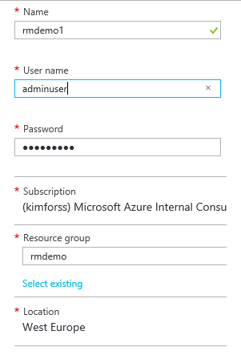

#VM Extensions
This guide provides an introduction on how to deploy and use a VM Extension 

##Contents
* [Pre-Requisites](#pre)	
* [Setup](#setup)	
* [Demo Steps](#demosteps)	
* [Clean Up](#cleanup)	

## <a name="pre"></a> Pre-Requisites
This section lists the pre-requisites required for this demonstration.
* Azure subscription
* Azure PowerShell
* A Virtual machine running in resource manager mode


## <a name="setup"></a> Setup 
*Estimated time: 15 minutes*
1.	Sign-in to the Azure portal.
2.	NEW > Compute > Windows Server 2012 R2 Datacenter.
3.	Set Deployment model to Resource Manager.
4.	Click Create.
5.	Apply Basic settings:
   - Set a Host Name (e.g. rmdemo1).
   - Set user name (e.g. adminuser).
   - Set a password (e.g. MyD3m0P@ssw0rd).
   - Create a resource group called rmdemo
   
    
    
6.	Click OK.


## <a name="demosteps"></a> Demo Steps
*Estimated time: 8 minutes*
1.	Open PowerShell
2.	Authenticate to Azure using the Login-AzureRmAccount command
3.	If you have multiple subscriptions choose the correct one using the `Select-AzureRmSubscription -SubscriptionId [SubscriptionID]` command
4.	List the virtual machines using the `Get-AzureRMVM` command

Verify the service name of the RMDemo1 Virtual machine 
5.	Deploy password reset  extension using the following:
```C#
$vm=Get-AzureRMVM -ResourceGroupName rmdemo -Name rmdemo1 

`Set-AzureRmVMAccessExtension -ResourceGroupName $vm.ResourceGroupName -VMName $vm.Name -Name "Contoso" -TypeHandlerVersion "2.0" -UserName adminUser -Password t0pSecret!
Update-AzureRmVM -VM $vm -ResourceGroupName $vm.ResourceGroupName` 
```
6.	Restart the Virtual Machine `Restart-AzureRMVM -ResourceGroupName rmdemo -Name rmdemo1`
7.	Connect to the Virtual machine and logon using the new password

## <a name="cleanup"></a> Clean Up
To clean up this environment delete the virtual machine you created in the Setup section.
